<!-- Assets are generated: `node scripts/build-modern.mjs` (hero, headers, bento tiles, contact)
     and `node scripts/stats.mjs` (stats card). Pure SVG with SMIL animation, no external services. -->

<a href="https://rohan-portfolio-e864a.web.app">
  
</a>

  
  
  

 

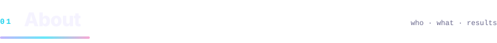


 

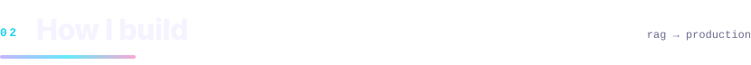


 

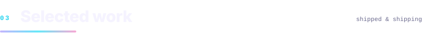

  <a href="https://rohan-portfolio-e864a.web.app"></a>
  <a href="https://mercurydasha.com"></a>
  <a href="https://travelwithmoiz.com"></a>
  <a href="https://github.com/rohan-techverx/BIlling-reports-rag"></a>
  <a href="https://rohan-portfolio-e864a.web.app"></a>
  <a href="https://rohan-portfolio-e864a.web.app"></a>

 

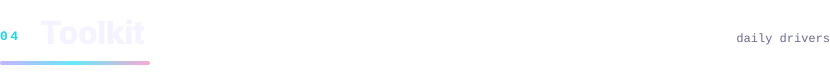


📜 &nbsp;Python for Data Science — IBM &nbsp;·&nbsp; Django REST Framework — Udemy &nbsp;·&nbsp; Python AI/ML Bootcamp — PureLogics

 

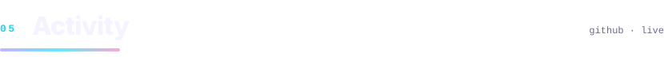

<picture>
  <source media="(prefers-color-scheme: dark)" srcset="https://raw.githubusercontent.com/Rohankhan5990/Rohankhan5990/output/snake-dark.svg" />
  <source media="(prefers-color-scheme: light)" srcset="https://raw.githubusercontent.com/Rohankhan5990/Rohankhan5990/output/snake-light.svg" />
  
</picture>

  

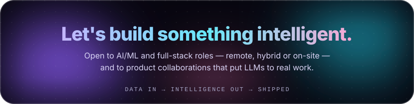

  
  
  

