<!-- Assets are generated: `node scripts/build-assets.mjs` (headers, pipeline, cards, toolkit)
     and `node scripts/stats.mjs` (stats card). The hero is a pre-rendered three.js scene. -->

<a href="https://rohan-portfolio-e864a.web.app">
  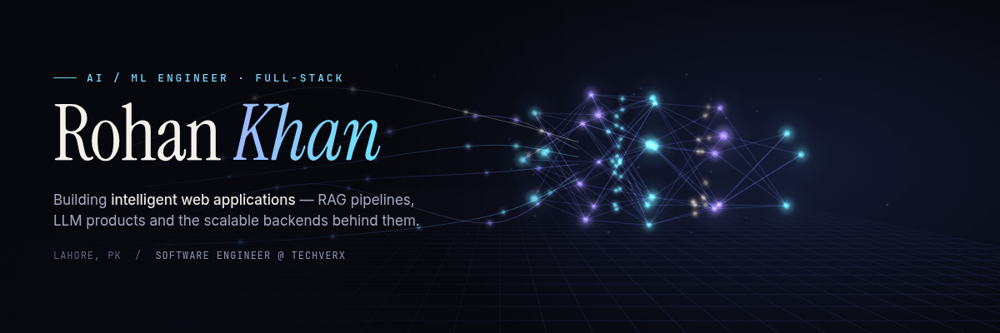
</a>

  
  
  

 


I'm a **Software Engineer in Lahore** who builds **AI-powered web applications** end to end — from the retrieval pipeline and the LLM prompt to the API, the interface and the cloud it runs on.

- 🧠 &nbsp;**AI / ML** — RAG pipelines with LangChain + ChromaDB, LLM features on GPT-4o, Claude and Gemini, semantic search, OCR automation that cut manual data entry by **60%**
- ⚙️ &nbsp;**Backend** — Django REST, FastAPI and NestJS services; PASETO / JWT / Azure AD SSO; Redis queues
- 🖥️ &nbsp;**Web** — Next.js and React products with clean, fast interfaces
- ☁️ &nbsp;**Cloud** — AWS (S3, ECS Fargate, CloudWatch) and DigitalOcean, with **99%+ uptime** in production

<table>
  <tr>
    <td width="50%" valign="top">
      <b>NOW</b> 
      <b>Software Engineer · Techverx</b> Jul 2025 – present 
      Enterprise SaaS APIs, RAG document Q&amp;A, QuickBooks automation (~80% less manual accounting), ~40% lower API latency.
    </td>
    <td width="50%" valign="top">
      <b>BEFORE</b> 
      <b>GenITeam Solutions</b> Associate SE · 2024 – 25 
      <b>InvoZone</b> Django intern · 2024 &nbsp;·&nbsp; <b>PureLogics</b> Python / data science · 2023 
      🎓 BSCS, University of South Asia (2020 – 2024)
    </td>
  </tr>
</table>

 


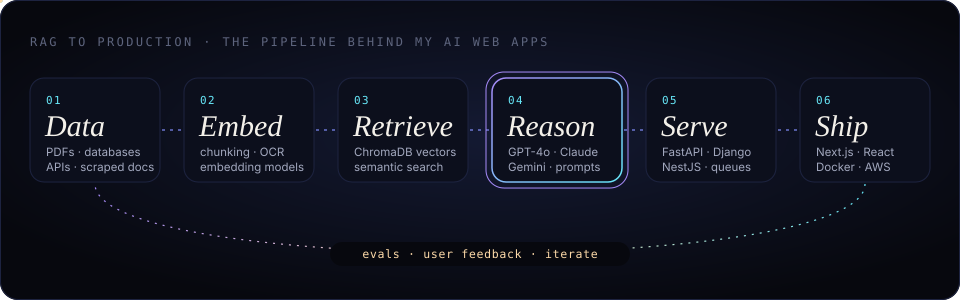

 

  <a href="https://mercurydasha.com"></a>
  <a href="https://travelwithmoiz.com"></a>
  <a href="https://github.com/rohan-techverx/BIlling-reports-rag"></a>
  <a href="https://rohan-portfolio-e864a.web.app"></a>
  <a href="https://rohan-portfolio-e864a.web.app"></a>
  <a href="https://rohan-portfolio-e864a.web.app"></a>

 

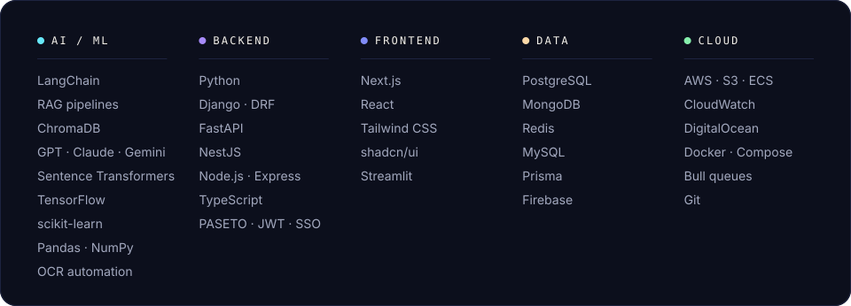

  

📜 &nbsp;Python for Data Science — IBM &nbsp;·&nbsp; Django REST Framework — Udemy &nbsp;·&nbsp; Python AI/ML Bootcamp — PureLogics

  


<picture>
  <source media="(prefers-color-scheme: dark)" srcset="https://raw.githubusercontent.com/Rohankhan5990/Rohankhan5990/output/snake-dark.svg" />
  <source media="(prefers-color-scheme: light)" srcset="https://raw.githubusercontent.com/Rohankhan5990/Rohankhan5990/output/snake-light.svg" />
  
</picture>

 


Open to **AI / ML and full-stack roles** — remote, hybrid or on-site — and to interesting product collaborations.
Building something with LLMs? I'd like to hear about it.

**✉️ [rohankhan5990@gmail.com](mailto:rohankhan5990@gmail.com)** &nbsp;·&nbsp; **[LinkedIn](https://www.linkedin.com/in/rohan-khan-01584a23a/)** &nbsp;·&nbsp; **[Portfolio](https://rohan-portfolio-e864a.web.app)** &nbsp;·&nbsp; 📱 +92 311 4364909

<i>Data in, intelligence out — shipped.</i>

