<!-- Assets are generated: `node scripts/build-assets.mjs` (headers, pipeline, cards, toolkit)
     and `node scripts/stats.mjs` (stats card). The hero is a pre-rendered three.js scene. -->

  
  
  

 

<picture><source media="(prefers-color-scheme: light)" srcset="https://raw.githubusercontent.com/Rohankhan5990/Rohankhan5990/main/assets/headers/about-light.svg" /><source media="(prefers-color-scheme: dark)" srcset="https://raw.githubusercontent.com/Rohankhan5990/Rohankhan5990/main/assets/headers/about-dark.svg" /></picture>

I'm a **Software Engineer in Lahore** who builds **AI-powered web applications** end to end — from the retrieval pipeline and the LLM prompt to the API, the interface and the cloud it runs on.

- 🧠 &nbsp;**AI / ML** — RAG pipelines with LangChain + ChromaDB, LLM features on GPT-4o, Claude and Gemini, semantic search, OCR automation that cut manual data entry by **60%**
- ⚙️ &nbsp;**Backend** — Django REST, FastAPI and NestJS services; PASETO / JWT / Azure AD SSO; Redis queues
- 🖥️ &nbsp;**Web** — Next.js and React products with clean, fast interfaces
- ☁️ &nbsp;**Cloud** — AWS (S3, ECS Fargate, CloudWatch) and DigitalOcean, with **99%+ uptime** in production

<picture><source media="(prefers-color-scheme: light)" srcset="https://raw.githubusercontent.com/Rohankhan5990/Rohankhan5990/main/assets/experience-light.svg" /><source media="(prefers-color-scheme: dark)" srcset="https://raw.githubusercontent.com/Rohankhan5990/Rohankhan5990/main/assets/experience-dark.svg" /></picture>

 

<picture><source media="(prefers-color-scheme: light)" srcset="https://raw.githubusercontent.com/Rohankhan5990/Rohankhan5990/main/assets/headers/flow-light.svg" /><source media="(prefers-color-scheme: dark)" srcset="https://raw.githubusercontent.com/Rohankhan5990/Rohankhan5990/main/assets/headers/flow-dark.svg" /></picture>

<picture><source media="(prefers-color-scheme: light)" srcset="https://raw.githubusercontent.com/Rohankhan5990/Rohankhan5990/main/assets/pipeline-light.svg" /><source media="(prefers-color-scheme: dark)" srcset="https://raw.githubusercontent.com/Rohankhan5990/Rohankhan5990/main/assets/pipeline-dark.svg" /></picture>

 

<picture><source media="(prefers-color-scheme: light)" srcset="https://raw.githubusercontent.com/Rohankhan5990/Rohankhan5990/main/assets/headers/work-light.svg" /><source media="(prefers-color-scheme: dark)" srcset="https://raw.githubusercontent.com/Rohankhan5990/Rohankhan5990/main/assets/headers/work-dark.svg" /></picture>

  <a href="https://mercurydasha.com"><picture><source media="(prefers-color-scheme: light)" srcset="https://raw.githubusercontent.com/Rohankhan5990/Rohankhan5990/main/assets/cards/mercury-dasha-light.svg" /><source media="(prefers-color-scheme: dark)" srcset="https://raw.githubusercontent.com/Rohankhan5990/Rohankhan5990/main/assets/cards/mercury-dasha-dark.svg" /></picture></a>
  <a href="https://travelwithmoiz.com"><picture><source media="(prefers-color-scheme: light)" srcset="https://raw.githubusercontent.com/Rohankhan5990/Rohankhan5990/main/assets/cards/ai-travel-light.svg" /><source media="(prefers-color-scheme: dark)" srcset="https://raw.githubusercontent.com/Rohankhan5990/Rohankhan5990/main/assets/cards/ai-travel-dark.svg" /></picture></a>
  <a href="https://github.com/rohan-techverx/BIlling-reports-rag"><picture><source media="(prefers-color-scheme: light)" srcset="https://raw.githubusercontent.com/Rohankhan5990/Rohankhan5990/main/assets/cards/billing-rag-light.svg" /><source media="(prefers-color-scheme: dark)" srcset="https://raw.githubusercontent.com/Rohankhan5990/Rohankhan5990/main/assets/cards/billing-rag-dark.svg" /></picture></a>
  <a href="https://rohan-portfolio-e864a.web.app"><picture><source media="(prefers-color-scheme: light)" srcset="https://raw.githubusercontent.com/Rohankhan5990/Rohankhan5990/main/assets/cards/kheloo-light.svg" /><source media="(prefers-color-scheme: dark)" srcset="https://raw.githubusercontent.com/Rohankhan5990/Rohankhan5990/main/assets/cards/kheloo-dark.svg" /></picture></a>
  <a href="https://rohan-portfolio-e864a.web.app"><picture><source media="(prefers-color-scheme: light)" srcset="https://raw.githubusercontent.com/Rohankhan5990/Rohankhan5990/main/assets/cards/pdf-fraud-light.svg" /><source media="(prefers-color-scheme: dark)" srcset="https://raw.githubusercontent.com/Rohankhan5990/Rohankhan5990/main/assets/cards/pdf-fraud-dark.svg" /></picture></a>
  <a href="https://rohan-portfolio-e864a.web.app"><picture><source media="(prefers-color-scheme: light)" srcset="https://raw.githubusercontent.com/Rohankhan5990/Rohankhan5990/main/assets/cards/pmo-engine-light.svg" /><source media="(prefers-color-scheme: dark)" srcset="https://raw.githubusercontent.com/Rohankhan5990/Rohankhan5990/main/assets/cards/pmo-engine-dark.svg" /></picture></a>

 

<picture><source media="(prefers-color-scheme: light)" srcset="https://raw.githubusercontent.com/Rohankhan5990/Rohankhan5990/main/assets/headers/toolkit-light.svg" /><source media="(prefers-color-scheme: dark)" srcset="https://raw.githubusercontent.com/Rohankhan5990/Rohankhan5990/main/assets/headers/toolkit-dark.svg" /></picture>

<picture><source media="(prefers-color-scheme: light)" srcset="https://raw.githubusercontent.com/Rohankhan5990/Rohankhan5990/main/assets/toolkit-light.svg" /><source media="(prefers-color-scheme: dark)" srcset="https://raw.githubusercontent.com/Rohankhan5990/Rohankhan5990/main/assets/toolkit-dark.svg" /></picture>

  

📜 &nbsp;Python for Data Science — IBM &nbsp;·&nbsp; Django REST Framework — Udemy &nbsp;·&nbsp; Python AI/ML Bootcamp — PureLogics

  

<picture><source media="(prefers-color-scheme: light)" srcset="https://raw.githubusercontent.com/Rohankhan5990/Rohankhan5990/main/assets/headers/activity-light.svg" /><source media="(prefers-color-scheme: dark)" srcset="https://raw.githubusercontent.com/Rohankhan5990/Rohankhan5990/main/assets/headers/activity-dark.svg" /></picture>

<picture><source media="(prefers-color-scheme: light)" srcset="https://raw.githubusercontent.com/Rohankhan5990/Rohankhan5990/main/assets/stats-light.svg" /><source media="(prefers-color-scheme: dark)" srcset="https://raw.githubusercontent.com/Rohankhan5990/Rohankhan5990/main/assets/stats-dark.svg" /></picture>

<picture>
  <source media="(prefers-color-scheme: dark)" srcset="https://raw.githubusercontent.com/Rohankhan5990/Rohankhan5990/output/snake-dark.svg" />
  <source media="(prefers-color-scheme: light)" srcset="https://raw.githubusercontent.com/Rohankhan5990/Rohankhan5990/output/snake-light.svg" />
  
</picture>

 

<picture><source media="(prefers-color-scheme: light)" srcset="https://raw.githubusercontent.com/Rohankhan5990/Rohankhan5990/main/assets/headers/connect-light.svg" /><source media="(prefers-color-scheme: dark)" srcset="https://raw.githubusercontent.com/Rohankhan5990/Rohankhan5990/main/assets/headers/connect-dark.svg" /></picture>

Open to **AI / ML and full-stack roles** — remote, hybrid or on-site — and to interesting product collaborations.
Building something with LLMs? I'd like to hear about it.

**✉️ [rohankhan5990@gmail.com](mailto:rohankhan5990@gmail.com)** &nbsp;·&nbsp; **[LinkedIn](https://www.linkedin.com/in/rohan-khan-01584a23a/)** &nbsp;·&nbsp; **[Portfolio](https://rohan-portfolio-e864a.web.app)** &nbsp;·&nbsp; 📱 +92 311 4364909

<i>Data in, intelligence out — shipped.</i>

